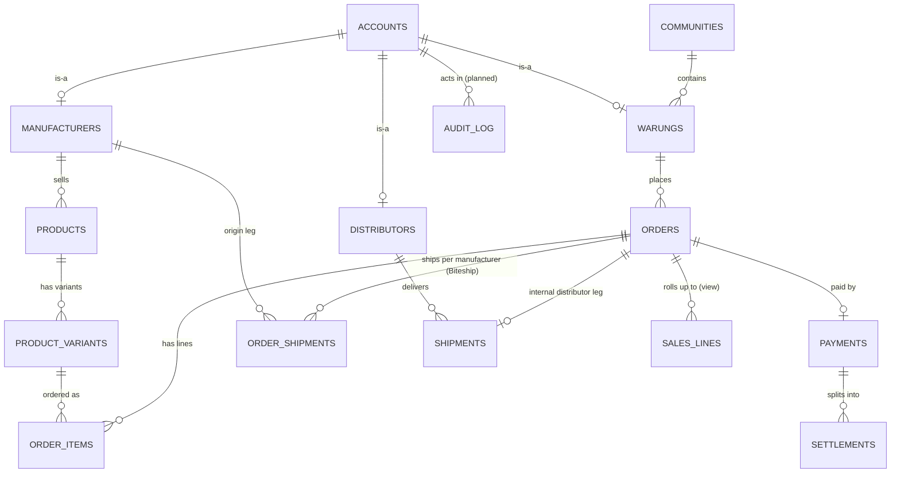

# Manifest / HALINEST — Architecture & Implementation Plan

This document describes the framework structure for **HALINEST** — the three-sided B2B
distribution marketplace defined in `HALINEST APPS (H) – BASIC FLOW CHART (ver02.00)`.
It supersedes the earlier single-org "internal inventory app" design: HALINEST is
inherently **multi-party** (buyers, sellers, logistics, platform), and that decision
drives every section below.

> _Every unit, accounted for._

For the end-to-end business/application flow (the PASSIVE/ACTIVE bands of the chart),
see [halinest-flow.md](halinest-flow.md). For the runnable schema, see
[`../supabase/migrations/`](../supabase/migrations/).

---

## 1. Goals

- Native cross-platform app target: **iOS, Android, Web**.
- The current repo already implements the **web** marketplace flow: manufacturers publish a
  catalog, warungs place orders, HALINEST applies a **manufacturer-specific fee rate** (the
  buyer price is derived from `net_price × (1 + fee_rate)`), and distributors fulfill.
- **Four party types** with distinct interfaces:
  **Platform Admin · Manufacturer · Warung · Distributor**.
- **Multi-tenant from day one** — "extendable to many communities"; every party is a tenant.
- A **BigData / analytics layer** that turns every transaction into "FREE Analyzes"
  dashboards served back to both buyers and sellers, plus **Market Information** and
  **PROFIT** ledgers.
- Supabase-backed (Postgres + Auth + Storage), with **payment-split settlement** so the
  net price routes to the manufacturer, the fee to HALINEST, and the commission to the distributor.
- Strong audit trail — every order, payment, settlement, shipment and stock movement is
  traceable to an account and timestamp.

---

## 2. Stack (confirmed)

| Layer            | Choice                                                                 |
| ---------------- | ---------------------------------------------------------------------- |
| Repo             | pnpm workspace (plain); Turborepo is still planned                       |
| Web              | Next.js 16 (App Router, Turbopack, RSC)                                |
| Mobile           | Expo SDK is planned; not yet implemented                                |
| Language         | TypeScript (strict)                                                      |
| Styling (web)    | Tailwind CSS v4 — `@theme` brand tokens (paper/parchment/ink/margin/signal/verified/border); fonts Inter + IBM Plex Mono |
| Styling (mobile) | NativeWind is planned for the future                                     |
| Backend          | Supabase (Postgres + Auth + Storage) — local via Docker **and** a cloud project (ref `mnxcalicwnrcnxvcnfip`, Seoul) |
| Auth clients     | `@supabase/ssr` — browser + server clients, **PKCE** flow                |
| i18n             | Cookie-based EN/ID (`src/i18n/*`); whole UI translated                    |
| Shipping         | Biteship courier API (server-only key) for rates/booking/tracking        |
| Maps             | Google Maps JS API (`LocationPicker`) for GPS capture at signup + address editors |
| Email            | Local dev via **Mailpit** (`:54324`); Resend planned for production      |
| Payments         | **Manual** confirmation (no gateway yet); Midtrans deferred              |
| Hosting (web)    | Local dev only — **not yet deployed to Vercel**                          |
| Hosting (mobile) | EAS Build target, not yet used                                           |
| Type generation  | `supabase gen types` into the web app and root demo client               |

---

## 3. Directory Structure

This is the **target** layout. What exists today is marked `[built]`; everything else is
planned. (For the precise current state see [ai_memory.md §3](ai_memory.md).) Two deliberate
deviations from the original plan: the repo is a plain **pnpm workspace** (Turborepo deferred
until a second app lands), and the schema ships as **timestamped** migrations rather than the
numbered `0001–0005` files below — the base `*_schema` / `*_rls` / `*_catalog_view` /
`*_logistics` / `*_signup` / `*_analytics` set has since grown a long tail of incremental
migrations (fee-admin-only, account location, order/multi-origin shipping, payment-split
shipping leg, tracking, variant weight, shipment status sync, cancel/return, etc.). Triggers
and manual-payment tables live inside `*_schema.sql`.

```
manifest/
├── apps/
│   ├── web/                          # Next.js 16 (App Router) + Tailwind v4  [built]
│   │   ├── src/
│   │   │   ├── app/
│   │   │   │   ├── login/            # sign-in                             [built]
│   │   │   │   ├── signup/           # self-service signup (role, phone→+62, GPS) [built]
│   │   │   │   ├── forgot-password/  # request reset email                 [built]
│   │   │   │   ├── reset-password/   # recovery-session set new password   [built]
│   │   │   │   ├── account/          # change email + password             [built]
│   │   │   │   ├── orders/           # warung: own orders (RLS-scoped)     [built]
│   │   │   │   │   └── analytics/    # warung order analytics              [built]
│   │   │   │   ├── shop/             # warung: catalog + place order       [built]
│   │   │   │   ├── catalog/          # manufacturer: products, add, orders [built]
│   │   │   │   │   └── analytics/    # manufacturer sales dashboard        [built]
│   │   │   │   ├── admin/            # admin: confirm payments, shipments  [built]
│   │   │   │   │   ├── analytics/    # platform dashboard                  [built]
│   │   │   │   │   └── shipments/[id]/label/  # printable Biteship label   [built]
│   │   │   │   ├── logistics/        # distributor: advance shipments      [built]
│   │   │   │   └── api/shipping/     # rates · book · track · cancel · return (Biteship) [built]
│   │   │   ├── components/           # shared client components (LocationPicker, LanguageSwitcher, …) [built]
│   │   │   ├── i18n/                 # config · server · client · dictionaries (EN/ID) [built]
│   │   │   ├── lib/supabase/         # browser + server + middleware-helper + types [built]
│   │   │   └── proxy.ts              # Supabase session refresh (Next 16)  [built]
│   │   └── package.json
│   │
│   └── mobile/                       # Expo (managed) + expo-router        (planned)
│
├── packages/                         # (all planned — not yet extracted)
│   ├── db/ · auth/ · ui/ · features/ · config/ · utils/
│
├── supabase/                                                              [built]
│   ├── migrations/                   # timestamped; base set + incremental tail
│   │   ├── *_schema.sql              # enums, identity, catalog, orders, payments, triggers
│   │   ├── *_rls.sql                 # RLS helpers + policies; triggers → SECURITY DEFINER
│   │   ├── *_catalog_view.sql        # `catalog` read-model (public; definer view)
│   │   ├── *_logistics.sql           # internal-distributor shipments + commission settlement leg
│   │   ├── *_signup.sql              # handle_new_user trigger (accounts + party row)
│   │   ├── *_analytics.sql           # `sales_lines` view (security_invoker → respects RLS)
│   │   └── *_shipping / *_location / … # order_shipments, payment-split shipping, set_my_location RPC, cancel/return
│   ├── seed.sql                      # demo data — retained but DISABLED ([db.seed] enabled=false)
│   └── config.toml
│
├── src/                              # standalone typed-client RLS demo    [built]
├── pnpm-workspace.yaml · package.json · README.md                         [built]
└── (planned: turbo.json, .env.example, supabase/functions/)
```

---

## 4. Domain model

The chart's nodes map to four logical groups. Full DDL lives in the
[`supabase/migrations/`](../supabase/migrations/) `*_schema.sql` file (timestamped).



### Group 1 — Identity & Onboarding (PASSIVE ACTION)
`communities` · `accounts` (1:1 `auth.users`; carries `role account_role`
= warung|manufacturer|distributor|admin, plus `full_name`, `phone`, `community_id`,
`address`, `latitude`, `longitude`) · `warungs` (`shop_name`, `address`) ·
`manufacturers` (`company_name`, `fee_rate`, `contract_signed_at`, and shipping
origin: `origin_latitude`, `origin_longitude`, `origin_address`) ·
`distributors` (`company_name`).

### Group 2 — Catalog & Pricing (the Manufacturer "Input List")
`products` (`manufacturer_id`, `name`, `brand`, `category`, `is_active`) ·
`product_variants` (`variant_name`, `net_price`, `weight`, `is_active`).
Selling price is derived: `net_price × (1 + fee_rate)`, with `fee_rate` per-manufacturer
and **admin-only** to change (`manufacturers_guard_fee` trigger). Quantity discounts,
promotions and bonus rules remain **planned** (not yet in schema).

### Group 3 — Transactions & Fulfillment (ACTIVE ACTION 1–4)
`orders` (`warung_id`, `status order_status` = cart|placed|paid|shipped|delivered|closed|cancelled,
`subtotal`, `fee`, `total`, plus courier fields `shipping_fee`, `shipping_courier`,
`shipping_service`) · `order_items` (`variant_id`, `qty`, `unit_net_price`, `line_subtotal`,
`line_fee`) · `payments` (`amount`, `status` = pending|confirmed, `confirmed_by`,
`confirmed_at`, `confirmation_note`) · `settlements` (payee = manufacturer | halinest |
distributor | courier).

**Shipping legs (two kinds):**
- `order_shipments` — **per-manufacturer, multi-origin** external shipping via Biteship:
  `(order_id, manufacturer_id)` unique; `courier`, `service`, `fee`, `tracking_number`,
  `shipping_order_ref`, `shipping_order_id`, `status`, plus return fields
  `return_shipping_order_id`, `return_tracking_number`, `return_status`.
- `shipments` — internal-distributor leg: `distributor_id`, `status`
  (planned|loaded|in_transit|delivered|reconciled|cancelled), `commission`.

### Group 4 — BigData / Analytics (ACTIVE ACTION 5–6)
Today the analytics layer is two Postgres **views**:
- `catalog` — buyer read-model: `sell_price = net_price × (1 + fee_rate)`, including `weight`
  and `manufacturer_id` (SECURITY DEFINER so buyers can browse without seeing net cost).
- `sales_lines` — `security_invoker` analytics view (respects the caller's RLS), backing the
  warung / manufacturer / admin dashboards.

The richer BigData nodes (`market_information`, `ledger_bonus` / **Black Bonus**,
`ledger_profit`, `audit_log`) remain **planned**.

**Dashboards are pure queries over `sales_lines`:**
- Manufacturer "FREE Analyzes" → `GROUP BY brand / name / variant / region`; Pareto =
  cumulative-revenue rank of `warung_id`; Sales Growth = period-over-period.
- Community "FREE Analyzes" → Avg Weekly Order per variant; Forecast / Cash-Out Plan =
  moving average over that.

### Triggers & RLS helpers
- **Order math:** `order_items_fill` (BEFORE — fills unit price / line subtotal / line fee),
  `orders_recompute` (AFTER — rolls line totals into `subtotal`/`fee`/`total`).
- **Money:** `payment_split` on payment `confirmed` → net→manufacturer, fee→HALINEST,
  shipping→courier; skips the distributor commission when the order carries an external
  (Biteship) shipping fee. `manufacturers_guard_fee` restricts `fee_rate` changes to admin.
- **Internal shipment:** `shipment_fill` / `shipment_settle` (commission settlement leg).
- **External shipment status sync:** `order_shipment_sync_order_status` advances the order
  → `shipped` when all legs are booked and → `delivered` when all legs delivered
  (forward-only; ignores cancelled legs).
- **RLS helpers (SECURITY DEFINER):** `auth_role()`, `is_admin()`, `owns_order()`,
  `mfr_in_order()`. `set_my_location(p_lat, p_lng, p_address)` is a SECURITY DEFINER RPC that
  updates **only the caller's own** coordinate/address columns — `accounts` has a SELECT-only
  policy (no blanket UPDATE), which prevents role self-escalation.

---

## 5. Party-Based Access (RLS Matrix)

Roles: `admin` (HALINEST platform) · `manufacturer` · `warung` · `distributor`.
Enforced in Postgres (see the `*_rls.sql` migration + the SECURITY DEFINER helpers
`auth_role()` / `is_admin()` / `owns_order()` / `mfr_in_order()`); the web UI mirrors it
client-side for UX only. Rows for `quantity_discounts` / `promotions` / `routes` /
`sales_facts` / `market_information` / `ledger_*` / `audit_log` are **planned** and omitted
below — the shipped tables/views are:

| Resource            | Admin | Manufacturer                         | Warung                          | Distributor                     |
| ------------------- | ----- | ------------------------------------ | ------------------------------- | ------------------------------- |
| communities         | CRUD  | Read                                 | Read                            | Read                            |
| accounts            | CRUD (row own via `set_my_location` RPC) | Read/self-locate     | Read/self-locate                | Read/self-locate                |
| warungs             | CRUD  | Read (of own buyers)                  | CRUD self                       | Read (assigned)                 |
| manufacturers       | CRUD  | CRUD self (fee_rate admin-only)      | Read                            | Read                            |
| distributors        | CRUD  | Read                                 | Read                            | CRUD self                       |
| products / variants | CRUD  | CRUD own                             | Read (active, via `catalog`)    | Read                            |
| orders              | CRUD  | Read (containing own products)       | CRUD own                        | Read (assigned shipments)       |
| order_items         | CRUD  | Read (own products)                  | CRUD (own order)                | Read (assigned)                 |
| payments            | CRUD (confirm) | Read (own settlements)      | Read own                        | Read (own commission)           |
| settlements         | CRUD  | Read own                             | —                               | Read own                        |
| order_shipments     | CRUD  | Read/manage own origin leg           | Read own                        | —                               |
| shipments (internal)| CRUD  | Read (own orders)                    | Read own                        | CRUD (assigned); Update status  |
| catalog (view)      | Read  | Read                                 | Read (active)                   | Read                            |
| sales_lines (view)  | Read (all) | Read (own products only)        | Read (own purchases only)       | Read (own scope)                |

---

## 6. Auth & Routing Flow

### Web (Next.js)
1. `proxy.ts` (Next 16's renamed `middleware` convention) refreshes the Supabase session cookie on every request. Clients use `@supabase/ssr` (browser + server) on the **PKCE** flow.
2. Server components resolve `account.role` via `lib/supabase/server.ts`; after login the user is sent to their **role home**: warung → `/orders`, manufacturer → `/catalog`, distributor → `/logistics`, admin → `/admin`.
3. Each party surface checks the role before rendering; `/admin` allows only `admin`, `/catalog` only `manufacturer`, `/logistics` only `distributor`, and `/orders` / `/shop` are for `warung`.
4. Data reads are server components; order/payment/shipment actions are client components using the browser Supabase client.

### Accounts, signup & password reset
- **`/signup`** — self-service: pick role, name, business name, phone (validated/normalized to
  `+62`), address, and GPS location via a Google Maps `LocationPicker` (with a manual-entry
  fallback). The `handle_new_user` trigger (SECURITY DEFINER) then creates the `accounts` row +
  the matching party row, and for manufacturers seeds `origin_latitude/longitude/origin_address`.
- **`/account`** — change email and password via `supabase.auth.updateUser`. The header account
  pill links here; landing-page CTAs adapt when a session is present.
- **`/forgot-password`** → `supabase.auth.resetPasswordForEmail` (redirects to
  `/reset-password`). **`/reset-password`** establishes a recovery session (from the URL hash
  or a PKCE `?code=`) and then calls `updateUser` to set the new password.
- **Self-locate:** address/coordinate changes go through the `set_my_location` RPC (manufacturer
  origin, warung delivery pin) via a modal editor — never a direct table UPDATE.

### i18n
Cookie-based **EN/ID** under `src/i18n/{config,server,client,dictionaries}`. Cookie `lang`,
default `en`. Server code uses `getLocale()` / `getDict()`; client code uses an `I18nProvider`
with `useT()` / `useLocale()`; a `LanguageSwitcher` sits in the header. The whole UI is
translated.

### Mobile (Expo + expo-router)
1. `app/_layout.tsx` mounts an `AuthProvider` (Supabase session listener).
2. `app/index.tsx` routes to `/(auth)/login` when no session, else into the party group
   matching `account.role`.
3. Each party group's `_layout.tsx` mounts only that role's tabs.
4. Session tokens stored in `expo-secure-store`.

---

## 7. Module Surface (initial routes/screens)

| Party / Module | Routes / screens in the current web UI                                                                 |
| -------------- | --------------------------------------------------------------------------------------------------------- |
| Warung         | `/orders` · `/orders/analytics` · `/shop`                                                                  |
| Manufacturer   | `/catalog` · `/catalog/analytics`                                                                          |
| Distributor    | `/logistics`                                                                                               |
| Platform Admin | `/admin` · `/admin/analytics` · `/admin/shipments/[id]/label` (printable Biteship label)                   |
| Shared/auth    | `/login` · `/signup` · `/account` · `/forgot-password` · `/reset-password` · landing (`/`)                 |
| Shipping API   | `/api/shipping/{rates,book,track,cancel,return}` (server-only Biteship key)                                |

---

## 8. Cross-Platform UI Strategy

- The current repo is still web-first; the app uses plain Tailwind styling and direct Supabase
  clients rather than a shared UI package yet.
- The intended cross-platform shape is still documented, but the actual implementation today is
  the Next.js web UI only.
- Forms in the current app are simple React state handlers; the shared schema/package layout is
  still planned rather than fully extracted.
- Server-side reads are done in server components; client-side actions use the browser Supabase client.

---

## 9. Build & Deployment

**DB / deploy state (2026-07-02):**
- **Web**: run locally with `pnpm --filter web dev`. **Not yet deployed to Vercel** — that is a
  planned step, alongside dev/prod branch separation (the next planned move).
- **Database**: runs both **locally** (Supabase via Docker) and on a **cloud** project
  (ref `mnxcalicwnrcnxvcnfip`, Seoul). Migrations are at **parity** local ↔ cloud. Both DBs are
  currently **EMPTY (wiped)**. **Seeding is DISABLED** (`config.toml [db.seed] enabled=false`);
  `seed.sql` is retained. No CI pipeline for automatic migration pushes yet.
- **Local env**: Mailpit serves auth emails at `:54324`; `config.toml
  additional_redirect_urls` allows `http://localhost:3000/**` and `http://127.0.0.1:3000/**`.
- **Shipping/maps env**: `BITESHIP_API_KEY` (server-only), `SHIPPING_ORIGIN_*`,
  `NEXT_PUBLIC_GOOGLE_MAPS_API_KEY`.
- **Mobile**: not implemented yet; EAS build is still a future target.
- **Type sync**: regenerate types from the DB after schema changes. Today that targets
  `apps/web/src/lib/supabase/database.types.ts` (and the root demo client), not a shared
  extracted package yet.

---

## 10. Implementation Phases

> **Build status (2026-07-02).** The repo is **web-first**: the Supabase schema + RLS +
> money/settlement engine run on both a local Docker stack and a cloud project (migrations in
> parity). The web app covers the four roles with live pages for catalog, orders, admin
> confirmation, shipments (internal + Biteship), and analytics — plus account self-service,
> forgot/reset password, per-manufacturer multi-origin shipping, and EN/ID i18n. Both databases
> are currently **empty** (wiped) with seeding disabled while data is re-entered manually.
> Still pending: shared `packages/*`, mobile, contract-approval UX, bonus/profit ledgers,
> tests, CI, Midtrans, Biteship webhook, **Vercel frontend deploy**, and dev/prod branching.

| Phase | Deliverable                                                                       | Status |
| ----- | --------------------------------------------------------------------------------- | ------ |
| 0     | Repo bootstrap: pnpm **workspace** (Turborepo deferred), tsconfig, ESLint          | ✅ (pnpm workspace; no Turborepo yet) |
| 1     | Supabase + migrations (schema, RLS, triggers, seed, manual payments)               | ✅ (local only; timestamped migrations, not `0001–0005`) |
| 2     | Generated types + query helpers                                                    | ◑ types generated into `apps/web` & root `src`; no `packages/db` |
| 3     | Auth + Next.js session refresh + login                                            | ✅ login + `proxy.ts` session refresh + role-aware redirect |
| 4     | Expo app skeleton                                                                  | ⬜ not started |
| 5     | `packages/ui` primitives + shared Tailwind/NativeWind preset                       | ◑ web styled with Tailwind + brand tokens; no shared `packages/ui` |
| 6     | Onboarding: registration + admin approval                                          | ◑ self-service signup done; contract/approval UX still pending |
| 7     | Catalog module (manufacturer Input List, promotions, fee-based pricing)            | ✅ products view/add + fee-based buyer pricing; promotions remaining |
| 8     | Ordering module (search, discount, order & **manual payment** confirmation, split) | ✅ place order + admin confirm → settlement split; search/discount UX pending |
| 9     | Logistics module (routes, shipments, reconciliation, commission)                   | ✅ shipments + status advance + commission settlement done; routes/reconcile pending |
| 10    | BigData / FREE Analyzes dashboards + Market Information + bonus/profit ledgers      | ✅ manufacturer + admin analytics done (`sales_lines` view); ledgers/Market Info pending |
| 11    | CI (typecheck, lint, migrations), Vercel + EAS deploy, README finalization          | ⬜ not started (local only, no cloud) |

Legend: ✅ done · ◑ partial · ⬜ not started.

---

## 11. Open Questions — reconciled against the flowchart

The chart answers several questions the old single-org doc had left open; updated stances below.

1. **Multi-tenant?** — **Resolved by the chart: yes, multi-party from day one.** Warungs,
   manufacturers and distributors are separate registering tenants ("extendable to many
   communities"). `communities` + per-party tables exist in migration 0001.
2. **Payments** — **Current: manual payment (no gateway yet).** The buyer pays the
   order total (as computed by the DB) out-of-band (e.g. bank transfer), and the admin
   confirms receipt, which flips the payment to `confirmed` and fires `payment_split()`
   to settle net → manufacturer and fee → HALINEST. Distributor commission is added only
   when a shipment exists, so the settlement flow is split between payment and shipment.
   See §12. **A Midtrans (Snap) gateway is deferred** — the payment flow is designed so the
   gateway can replace the manual confirmation step without changing the settlement logic.
3. **Who is the Distributor?** — chart says "Manufacturers **or Distributor**" on the sell
   side and a separate Distributor lane on logistics. **Assume:** distributor is a distinct
   party type that may be 3rd-party or HALINEST-internal (`distributors.type`).
4. **Currency / locale** — **IDR**, single platform-wide currency in settings.
5. **Auth method** — email + password to start; magic link later.
6. **Offline support (mobile)** — out of scope for v1; add via TanStack Query persistence later.
7. **File uploads** — product photos + contract documents → Supabase Storage bucket
   `attachments`; wire from phase 7.
8. **Resend email** — registration/contract-approval emails + (later) daily analyzes digest.
9. **Fee configurability** — the current implementation already treats the fee as
   per-manufacturer via `manufacturers.fee_rate`; the docs should not describe it as a single
   fixed platform-wide rate.
10. **Bonus / Black Bonus mechanics** — accrual & redemption rules are modeled as
    `bonus_rules.rule_jsonb` + `ledger_bonus`; **exact formulas still to be defined by the business.**

---

---

## 12. Payments — Manual confirmation

IDR payments are handled **manually** for now; no payment gateway is wired. The buyer pays
out-of-band and an operator (platform admin) confirms receipt, which drives the same
settlement split. **A Midtrans (Snap) gateway is planned for the next development phase**
(see the deferred note at the end of this section).

```
Warung places order (status: placed), picking a courier per manufacturer at checkout
   │
   ├─► payment row created: status=pending, amount = orders.total
   │     (total = subtotal + fee + shipping_fee)
   │
   ├─► buyer pays out-of-band (e.g. bank transfer) for the order total
   │
   └─► operator confirms receipt → payments.status = confirmed
         (records confirmed_by / confirmed_at / confirmation_note)
         • on confirmed ⇒ DB trigger payment_split() inserts settlements:
                     net       → manufacturer
                     fee       → halinest
                     shipping  → courier
                     comm      → distributor  (SKIPPED when the order has an external
                                               Biteship shipping fee)
```

**Status enum:** `pending → confirmed` (no `settled`/`failed`/`refunded` states in the current
schema). The transition to `confirmed` is an operator action (RLS-restricted to admin) rather
than a gateway webhook; the `payment_split()` trigger and the settlement math are unchanged.

In the current app, the payment actions are implemented directly in the web pages/components
(using browser-side Supabase calls), rather than through a shared query module yet.

The runtime flow is still the same: apply migrations locally with the Supabase stack, then run
`pnpm --filter web dev` to exercise the UI.

> **Deferred — Midtrans (Snap), next development phase.** When the gateway lands, it slots
> in ahead of the manual confirmation step: a charge function creates a Snap token and a
> signed notification webhook flips `payments.status` to `confirmed`. Because the settlement
> split already keys off `confirmed`, adding the gateway is additive — it does not change the
> schema's settlement logic.

---

## 13. Shipping — Biteship (per-manufacturer, multi-origin)

External courier fulfillment runs through **Biteship**. The API key is **server-only**; the
browser never sees it. All calls go through Next.js route handlers under `/api/shipping`:

| Route                    | Purpose                                                        |
| ------------------------ | -------------------------------------------------------------- |
| `POST /api/shipping/rates`  | Quote courier rates (origin → warung destination, by weight)  |
| `POST /api/shipping/book`   | Book a shipment; stores `shipping_order_ref/id`, tracking no.  |
| `GET  /api/shipping/track`  | Poll courier tracking status                                   |
| `POST /api/shipping/cancel` | Cancel a booked shipment                                       |
| `POST /api/shipping/return` | Create a return leg (`return_*` fields on `order_shipments`)   |

Flow: at checkout the buyer **picks a courier per manufacturer** (multi-origin — each
manufacturer ships from its own `origin_*` coordinates). The shipping fee is **charged to the
buyer** (folded into `orders.total`) and **settled to the courier** by `payment_split()`; the
distributor commission is skipped for orders that carry an external Biteship fee. Each origin
leg is one `order_shipments` row (`unique(order_id, manufacturer_id)`). As legs are booked and
delivered, `order_shipment_sync_order_status` advances `orders.status`: → `shipped` once all
legs are booked, → `delivered` once all are delivered (forward-only, ignoring cancelled legs).
Admins can print a courier label at `/admin/shipments/[id]/label` (uses `window.print`).

Origin/destination coordinates come from the Google Maps `LocationPicker` at signup and from
in-app modal editors (manufacturer origin, warung delivery pin), persisted via the
`set_my_location` RPC. Env: `BITESHIP_API_KEY`, `SHIPPING_ORIGIN_*`,
`NEXT_PUBLIC_GOOGLE_MAPS_API_KEY`. A **Biteship webhook** for push status updates is not yet
wired (tracking is pull-based today).

---

## Next step

The core loop, manual payments, i18n, and Biteship shipping all work locally and on the cloud
DB (currently wiped). The remaining work is **dev/prod branch separation** (next), then Vercel
deploy, CI + tests, mobile (Expo), the Biteship webhook, Midtrans, onboarding
contracts/admin-approval, promotions/quantity discounts, and the bonus/profit ledgers.
